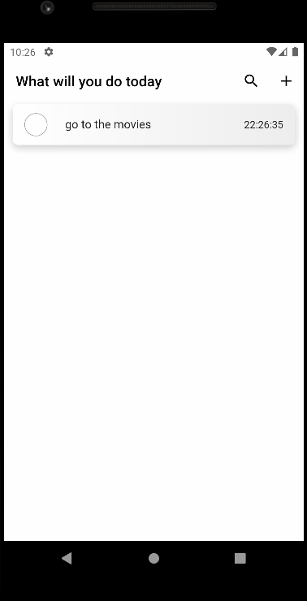

# TO DO APP

## Table of contents

- [Screenshot](#screenshot)
- [APK](#apk)
- [Used Packages](#packages)
- [Author](#author)

## Screenshot

Here you see the mobile preview of the project.

## APK

[You can download the application by clicking here](https://drive.google.com/u/1/uc?id=1Zc8ZW-FCVQJzDPLwkH7Liq-wMfbiZBDQ&export=download&confirm=t)

## PACKAGES

[Easy Localization](https://pub.dev/packages/easy_localization) : static translation by device language

[Get It](https://pub.dev/packages/get_it) : This is a simple Service Locator for Dart and Flutter projects

[Uuid](https://pub.dev/packages/uuid) : Provides simple and fast uuid generation

[Intl](https://pub.dev/packages/intl) : Local date and number formatting

[Hive](https://pub.dev/packages/hive) : Lightweight and fast key/value local database. 

[Screen Util](https://pub.dev/packages/flutter_screenutil) : A flutter plugin for adapting screen and font size

[Flutter Datetime Picker](https://pub.dev/packages/flutter_datetime_picker) : A date time picker for flutter

## Author

\- LinkedIn - [Serdar ÖNCÜLER](https://www.linkedin.com/in/serdar-%C3%B6nc%C3%BCler-b88916184/)
